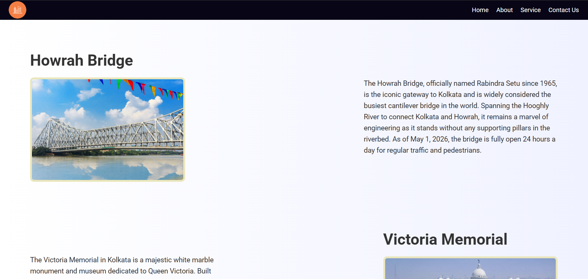
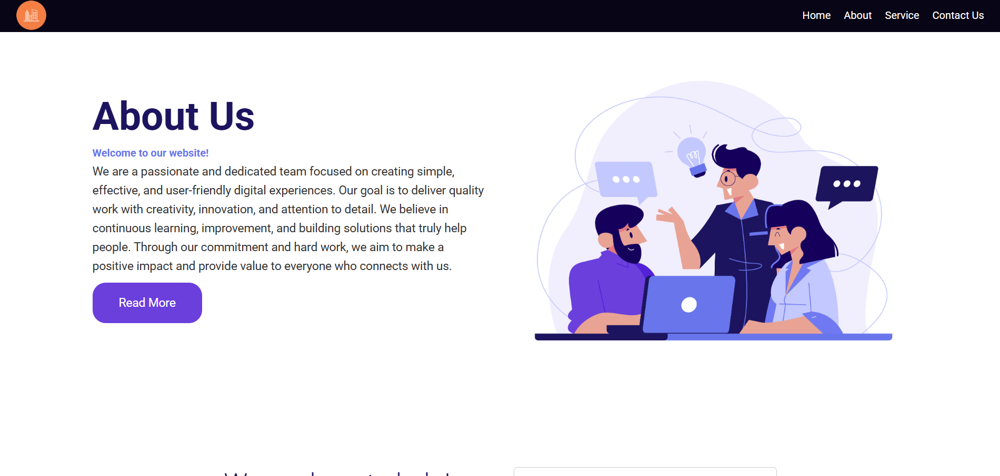
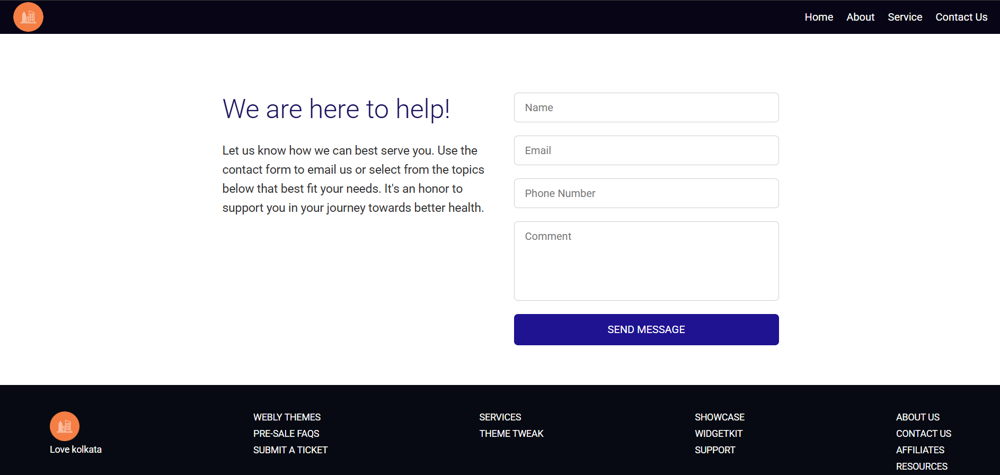

---

# ❤️ Love Kolkata

A simple and beautiful **HTML & CSS** project that showcases some of the most famous heritage places of Kolkata.

This is a sample static website created using only **HTML and CSS** to practice layout, styling, and responsive design.

---

## 🌆 About the Project

**Love Kolkata** is a basic front-end project that displays information about popular heritage places in Kolkata:

* 🌉 Howrah Bridge
* 🏛️ Victoria Memorial
* 🌅 Princep Ghat

The website highlights the beauty and historical importance of these places with images and descriptions.

---

## 🛠️ Built With

* HTML5
* CSS3

No frameworks or libraries were used — pure HTML and CSS.

---

## 📂 Project Structure

```
Love-Kolkata/
│
├── index.html
├── assets/
    └── CSS/
        |- style.css
    └── JS/
    └── Images/

```

---

## 📸 Screenshots

### 🏠 Home Page

Add your screenshot here:





### 🏠 About Page





### 🏠 Contact Page





---

## 🚀 How to Run the Project

1. Download or clone this repository
2. Open the folder
3. Double click on `index.html`
4. Open in any browser

---

## 🎯 Purpose of This Project

* Practice HTML structure
* Improve CSS styling skills
* Learn layout design
* Create a simple responsive website

---

## 📌 Future Improvements

* Add navigation bar
* Add animations
* Make it fully responsive
* Add more heritage places

---

## 👨‍💻 Author

**Sayan Das**

---